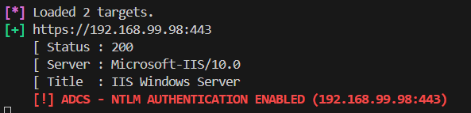

# Who's Up?

Enumerate web servers and NTLM relay targets (ADCS/SCCM) while avoiding IDS - just specify a CIDR range and kick back.

The script will report status codes, server headers, and HTML title tags if it can find them:


All alive hosts are saved to `web-hosts.txt` by default.

## Usage
```
options:
  -h, --help         show this help message and exit
  -p [ports]         Port list to test. Default is 80,443.
  --no-random        Don't randomly select hosts from subnets.
  -t [num]           Timeout in seconds. Default is 3s.
  -s [num]           Sleep in seconds. Default is 3s.
  -j [num]           Jitter in seconds. Default is 1s.
  -ua "Mozilla 1.x"  User-agent for requests. Default is Windows/Mozilla.
  --ntlm             Search for commonly abused NTLM authentication endpoints.
  -o web-hosts.txt   Output file for alive hosts. Defaults to web-hosts.txt.
  --debug            Show debug information.

targets:
  -r 10.10.10.0/24   Subnet range to scan (10.10.10.0/24)
  -rf subnets.txt    Subnet ranges file (10.10.10.0/24, 10.10.11.0/24, etc.)
  -tf hosts.txt      Newline-delimited single target file (10.10.10.10, 10.10.10.11, etc.)
  ```